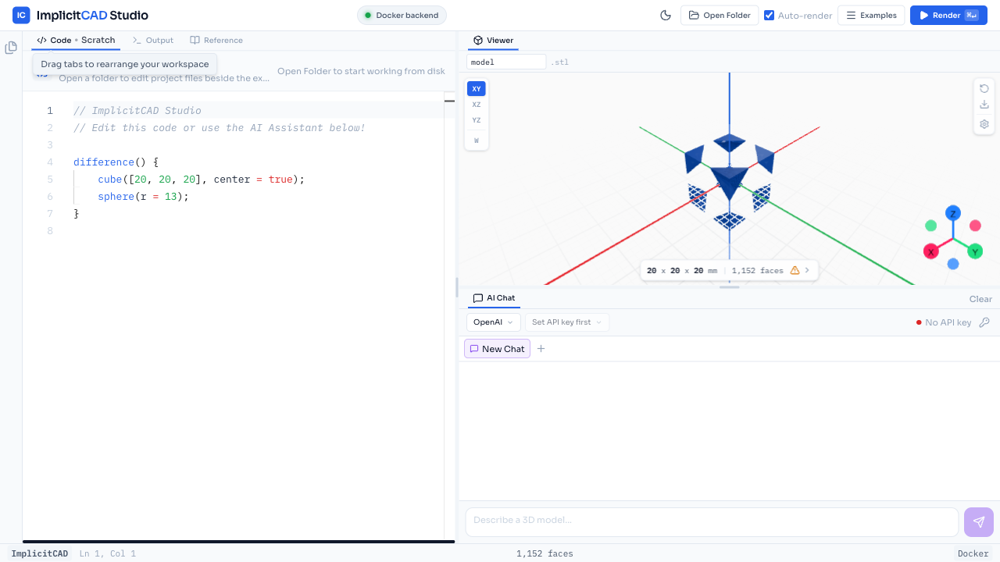

# Lowering Barriers to 3D Design: LLM-Assisted ImplicitCAD

This project fine-tunes an LLM to turn natural-language 3D editing requests into compilable ImplicitCAD code. The browser-based ImplicitCAD Studio in this repo is the demonstration environment for running, inspecting, and evaluating that model end-to-end.

### Results at a Glance

| | |
|---|---|
| **Training data** | 1,746 examples across two stages (1,571 OpenSCAD-converted + 139 hand-curated ImplicitCAD) |
| **Compilation success** | **80%** (24/30) vs 53% base model — whitepaper evaluation |
| **Inference speed** | **2.26s** vs 44.12s per case (19.5x faster) — local benchmark |
| **Training cost** | Under 5 minutes on a single A100, LoRA adapter ~300 MB |

> Suitable for rapid prototyping, research, and education. Not intended for manufacturing guarantees or safety-critical use.

## Overview

Code-based 3D modeling tools such as OpenSCAD and ImplicitCAD are precise and reproducible, but they are difficult for new users because geometric ideas must be translated into compilable programs. This project explores whether a domain-tuned LLM can lower that barrier by turning natural-language editing requests into working SCAD code, then pairing the model with compilation, mesh validation, and an interactive studio interface.

The main contribution of the project is the model-training and evaluation pipeline. ImplicitCAD Studio is the integrated demo environment built around that model.

Model weights are hosted on Hugging Face (see links in the [Model](#model) section below).

<div align="center">
  
  <br><em>ImplicitCAD Studio: edit code, compile to STL, preview in 3D, and generate code with AI</em>
</div>

### Quick Example

**Prompt:** "Add a sphere on top of the cube"

**Initial code:**
```scad
cube([20, 20, 20], center=true);
```

**Generated code:**
```scad
union() {
  cube([20, 20, 20], center=true);
  translate([0, 0, 15]) sphere(r=5);
}
```

The model takes a natural-language editing instruction plus existing code, and outputs a complete updated program that compiles with ImplicitCAD.

## Model

### Available Models

| Model | Size | Download | RAM Required | GPU | Best For |
|-------|------|----------|-------------|-----|----------|
| **Qwen3.5-9B** (recommended) | ~5 GB | [HuggingFace](https://huggingface.co/Max2475/Qwen3.5-9B-OpenSCAD-Instruct) | 8 GB+ | Optional | Main evaluated model from the whitepaper. Best balance of quality and hardware requirements. |
| **Qwen3.5-27B** | ~15.4 GB | Via `./studio.sh` -> "Add 27B" or [HuggingFace](https://huggingface.co/ziaoliu/Qwen3.5-27B-OpenSCAD-Instruct) | 32 GB+ | Recommended (16 GB+ VRAM) | Higher quality output, handles complex geometry better. Requires a powerful machine. |
| **Qwen3.5-0.8B** (test) | ~1 GB | Via `./studio.sh` → "Add 0.8B" | 4 GB | Not needed | Lightweight test model for verifying setup. Not fine-tuned — not representative of project quality. |

| Artifact | Link |
|----------|------|
| 9B Merged GGUF (Q4_K_M) | [huggingface.co/Max2475/Qwen3.5-9B-OpenSCAD-Instruct](https://huggingface.co/Max2475/Qwen3.5-9B-OpenSCAD-Instruct) |
| 9B LoRA Adapter (~300 MB) | [huggingface.co/Max2475/Qwen3.5-9B-OpenSCAD-LoRA](https://huggingface.co/Max2475/Qwen3.5-9B-OpenSCAD-LoRA) |
| 27B Merged GGUF (Q4_K_M) | [huggingface.co/ziaoliu/Qwen3.5-27B-OpenSCAD-Instruct](https://huggingface.co/ziaoliu/Qwen3.5-27B-OpenSCAD-Instruct) |
| 27B LoRA Adapter | [huggingface.co/Max2475/qwen3.5-27b-openscad-instruct-lora](https://huggingface.co/Max2475/qwen3.5-27b-openscad-instruct-lora) |

> The 9B model is the primary research artifact and the one evaluated in the whitepaper. The 27B model was also trained and performs better on complex prompts, but requires significantly more hardware. The 0.8B option is only for verifying that the local pipeline works.

### Problem

General-purpose LLMs can produce code that looks plausible, but geometric code generation has an extra failure mode: code may compile while producing the wrong shape. ImplicitCAD has a smaller ecosystem than mainstream languages — less documentation, less training data, and no established benchmarks.

This project targets that gap: ImplicitCAD-specific instruction following, verified compilation, and geometry-aware evaluation.

### Two-Stage Training Strategy

Training used a two-stage approach to build both breadth and depth:

**Stage 1 — OpenSCAD Foundation** ([`first-train/`](first-train/)):
- 1,571 training + 175 validation examples converted from OpenSCAD to ImplicitCAD-compatible code
- Sourced from OpenSCAD datasets on Hugging Face, then adapted to ImplicitCAD syntax
- Goal: teach the model basic SCAD syntax and common geometric patterns with broad coverage

**Stage 2 — ImplicitCAD Specialization:**
- ImplicitCAD is a superset of OpenSCAD with different syntax, features, and compilation behavior
- AI-converted OpenSCAD examples had poor quality (unsupported features like `hull()`, `minkowski()`)
- Solution: `139` hand-curated ImplicitCAD-specific 3D logic problems, each with instruction + initial code + expected output
- All examples manually verified to compile with the ImplicitCAD toolchain
- Covers 6 difficulty tiers: absolute placement, object-anchored, pattern completion, bounding-box, count/arrangement, interaction constraints

The Stage 2 dataset is in [`second-train/`](second-train/) with the compiled JSONL at [`second-train/scad_sft_dataset.jsonl`](second-train/scad_sft_dataset.jsonl).

### Fine-Tuning Configuration

| Parameter | Value |
|-----------|-------|
| Base model | `Qwen3.5-9B` |
| Method | LoRA |
| LoRA rank | `r=16` |
| LoRA scaling | `alpha=32` |
| LoRA dropout | `0` |
| Sequence length | `8k` |
| Optimizer | AdamW 8-bit |
| Effective batch size | `8` |
| Learning rate | `5e-5` |
| Warmup steps | `5` |
| Weight decay | `0.001` |
| Schedule | linear |
| Epochs | `2` |
| Total update steps | `36` |
| Hardware | Single A100 40 GB |
| Training time | Under 5 minutes (Google Colab) |

The resulting LoRA adapter is ~300 MB. After merging, the model was exported to GGUF Q4_K_M (~5 GB) via Unsloth for local inference through Ollama, llama.cpp, or LM Studio.

### Evaluation Results

**Whitepaper evaluation** (30-case held-out set):

| Metric | Base Model | Fine-Tuned | Improvement |
|--------|-----------|------------|-------------|
| **Compilation success** | 53% (16/30) | **80%** (24/30) | +27pp |

**Additional local benchmark** (`test_files/lmstudio_scad_benchmark_results*.txt`):

| Metric | Base Model | Fine-Tuned | Improvement |
|--------|-----------|------------|-------------|
| **Exact code match** | 30% (9/30) | **40%** (12/30) | +10pp |
| **Avg inference time** | 44.12s/case | **2.26s/case** | **19.5x faster** |

The fine-tuned model also produced much faster outputs in our local benchmark. Both compilation reliability and geometric alignment improved substantially over the base model.

### Scope and Limitations

This system is intended for:

- rapid prototyping
- research
- education
- iterative design assistance

It is not intended for:

- manufacturing guarantees
- safety-critical use
- dimensional certification

Automated validation and mesh checks improve robustness, but they do not guarantee that every generated model perfectly matches user intent or real-world engineering constraints.

## ImplicitCAD Studio

### What It Is

ImplicitCAD Studio is the demo application built around the training output above. It provides an end-to-end environment where a user can:

- edit SCAD code
- ask the model to modify or generate code
- compile the result with ImplicitCAD
- inspect the resulting STL in a live 3D viewer

The Studio is important because the model is most useful inside an interactive loop rather than as an isolated artifact.

### Key Features

- Monaco-based code editor with OpenSCAD-style syntax highlighting
- Three.js 3D viewer with orbit controls, camera presets, wireframe, and grid planes
- AI assistant panel with local Ollama support and optional OpenAI / Anthropic backends
- File explorer for local workspace editing
- STL export and viewport screenshots
- Output console, toast errors, and compile diagnostics

### Quick Start

```bash
git clone https://github.com/CSC392-CSC492-Building-AI-ML-systems/ImplicitCAD-Winter2026.git
cd ImplicitCAD-Winter2026
./studio.sh
```

> `.env` is optional — all defaults work out of the box on macOS/Windows with Docker Desktop. Copy `.env.example` to `.env` only if you need to customize ports, API keys, or Ollama URL (see [Troubleshooting](#troubleshooting) for Linux).

In the TUI:

1. run `First-time setup`
2. run `Start Studio`
3. optionally run `Add 9B (production)` or `Add 27B (advanced)` to download a fine-tuned model

> The first full Docker build can take about `15-20 minutes` because ImplicitCAD is compiled from Haskell source.

### System Requirements

- Docker `20+` with Docker Compose v2
- `4 GB` RAM minimum
- `8 GB+` RAM recommended for local AI inference
- about `10 GB` free disk space for Docker images and model assets
- Node.js `18+` only if you want to run the frontend dev server locally

### TUI Workflow

`./studio.sh` is the single supported user entry point.

| Menu Option | Purpose |
|-------------|---------|
| First-time setup | Verifies Docker, installs or checks Ollama, prepares the environment |
| Start Studio | Starts the Docker services and opens the app |
| Add 0.8B (test) | Downloads a lightweight test model (~1 GB download) |
| Add 9B (production) | Downloads the main fine-tuned model (~5 GB download, needs 8 GB+ RAM) |
| Add 27B (advanced) | Downloads the largest fine-tuned model (~15.4 GB download, needs 32 GB+ RAM) |
| View status | Shows service health, Ollama state, and model readiness |
| Advanced tools | Shell access, smoke tests, compile helpers, and logs |
| Stop all services | Stops Docker services and Ollama |
| Full rebuild | Rebuilds all containers from scratch |

### Docker Commands

```bash
docker compose up -d --build
docker compose port frontend 3000
docker compose down
docker compose logs -f
docker compose build --no-cache
```

Use `docker compose port frontend 3000` or `./studio.sh --status` to find the actual frontend URL when running the production Docker setup.

### Development Workflow

For frontend development with hot reload, run the backends in Docker and the frontend with Vite:

```bash
docker compose up -d implicitcad server

cd frontend
npm install --legacy-peer-deps
npm run dev
```

The Vite app starts at `http://localhost:3000` and proxies `/api` requests to the Docker server container.

If you want the production-like setup instead, run:

```bash
./studio.sh
```

and choose `Start Studio`.

### Architecture

```
        browser
           |
   Vite dev server or nginx
           |
         /api/*
           |
      Node.js server
           |
   extopenscad + admesh
           |
      STL -> Three.js viewer
```

| Container | Role | Port |
|-----------|------|------|
| `implicitcad-engine` | Helper container that provides the shared `extopenscad` binary volume and an exec/test target | not published |
| `implicitcad-server` | API server for compile, health, provider management, and AI chat | host `SERVER_HOST_PORT` (default `14000`) -> container `4000` |
| `implicitcad-frontend` | React app served by nginx in production Docker mode | dynamic host port -> container `3000` |

The frontend renders STL output with `Three.js`. The older direct `implicitsnap` render path is no longer part of the active UI pipeline.

### AI Providers

The Studio supports multiple model backends in the chat panel:

| Provider | Use Case |
|----------|----------|
| `Ollama` | Main local workflow, including the fine-tuned 9B model |
| `OpenAI` | Optional cloud comparison / testing |
| `Anthropic` | Optional cloud comparison / testing |

Configure defaults in `.env`, or use the API key dialog inside the app for cloud providers.

### Keyboard Shortcuts

| Shortcut | Action |
|----------|--------|
| `Cmd/Ctrl + Enter` | Compile and render |
| `Cmd/Ctrl + S` | Save current file |
| `Cmd/Ctrl + B` | Toggle file explorer |
| `Cmd/Ctrl + Shift + P` | Command palette |

### Compile From the Command Line

```bash
./studio.sh compile mymodel.scad -o mymodel.stl
./studio.sh exec server
```

Inside the server container, `"$EXTOPENSCAD"` and `admesh` are available for manual inspection and debugging.

## Repository Structure

```text
frontend/          React + Vite + TypeScript app
server/            Node.js API server and compile / chat orchestration
docker/            Dockerfiles and container entrypoints
ollama/            Ollama Modelfiles for the local app models
ai_context/        ImplicitCAD language reference material used by the server prompt
first-train/       Stage 1 training data (1,571 train + 175 val, OpenSCAD converted to ImplicitCAD)
second-train/      Stage 2 training data (139 curated ImplicitCAD examples)
test_files/        Benchmark cases (30-case eval set + ADMesh validation)
studio.sh          Main TUI entry point
.env.example       Runtime configuration template
```

## Troubleshooting

| Problem | What to check |
|---------|---------------|
| Port conflict on `14000` | Change `SERVER_HOST_PORT` in `.env` |
| Frontend URL unknown in Docker mode | Run `docker compose port frontend 3000` |
| Vite proxy errors in local dev | Ensure `docker compose up -d implicitcad server` is running |
| Ollama not reachable on Linux | Set `OLLAMA_HOST=0.0.0.0`, restart Ollama, and point `OLLAMA_URL` at the Docker bridge IP |
| Build runs out of memory | Increase Docker memory to at least `4 GB`, preferably more for local model use |
| Frontend loads but API fails | Check `docker compose logs server` and `./studio.sh --status` |

## Team

CSC398 Group 5

- Ziao Liu
- Ziheng Zhou
- Leon Wang
- Haoping Yang
- Hyeonbin (Owen) Chun

University of Toronto

## License

AGPL-3.0-or-later
